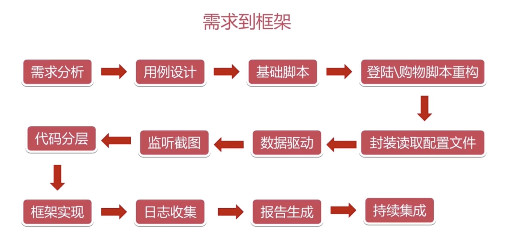
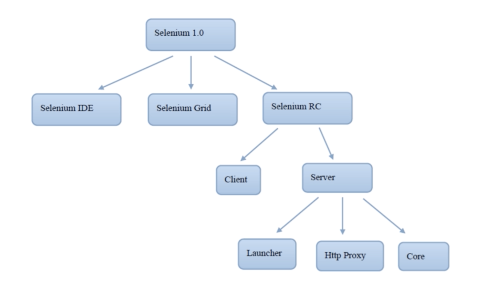
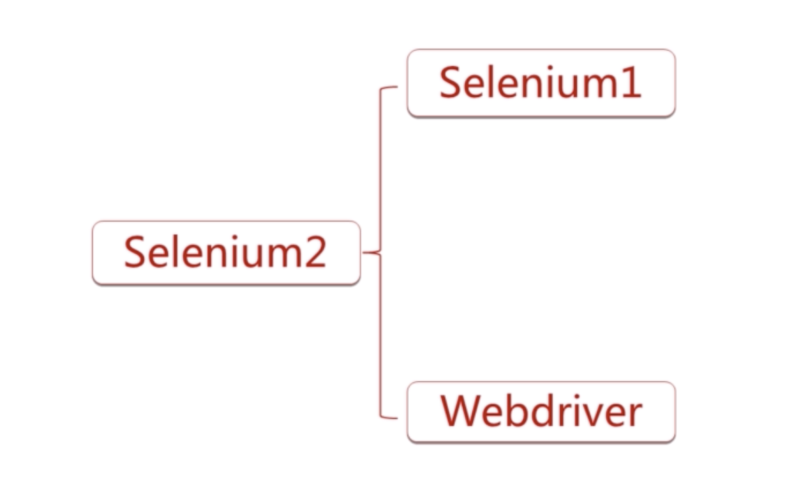
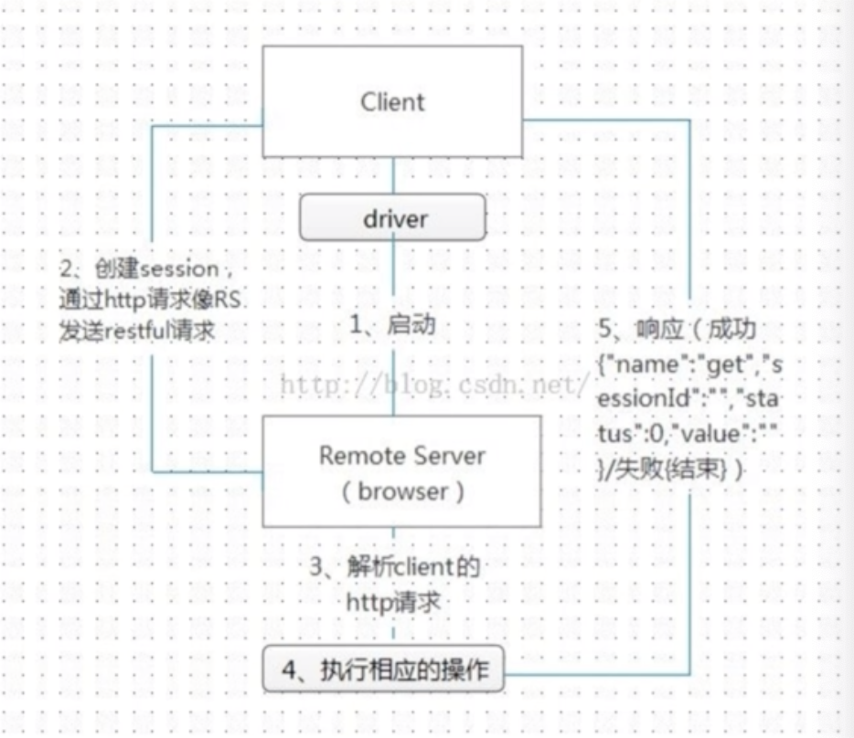
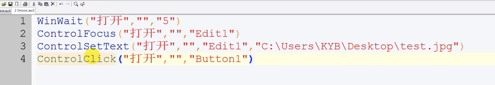
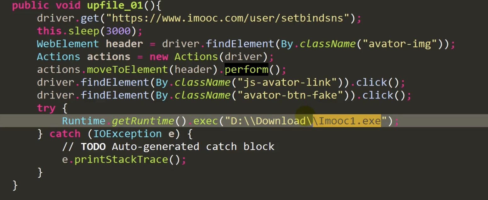

## 自动化测试的前提和整体介绍
### 需求到框架

### 功能测试VS性能测试
### 自动化测试流程
* 分析测试需求
* 选择方案
* 制定测试计划
* 环境
* 测试用例准备
* 编码
* 分析结果
### Selenium简介


### Selenium优势
* 开源
* 多浏览器支持
* 多平台
* api齐全
* 浏览器内运行
### 工作原理

## Selenium基础知识
### 元素定位
### 常见元素处理
* 文本框
    * sendkeys
    * clear
    * getAttribute-获取元素的各个属性
* 单选框
    * click
    * clear
    * isSelected
* 多选框
    * click
    * clear
    * isSelected
    * isEnabled
* 按钮
    * click
    * isEnabled
* 表单
* 上传文件
    * input标签，直接使用sendkeys("文件路径")
    * 使用第三分插件（au3）
     
     
* 下拉框
    * 下拉框定位 Select list=new Select(locator);
    * 下拉框操作
        * 选择对应元素
            * Text
            * Value
            * Index
        * 不选择对应元素(适用于多选下拉框【isMultiple()】)
            * deselectAll
            * deselectByValue
            * deselectByVisibleText
        * 获取选择项的值(只有被选中的值)
            * getAllSelectedOptions()
            * getFirstSelectedOptions().getText
* 鼠标操作
```
Actions action=new Actions(dirver);
//左击
Action.click(webElement).perform();
//双击
Action.doubleClick(webElement).perform();
//右击
Action.contextClick(webElement).perform();
//悬停
Action.moveToElement(webElement).perform();
```
* 窗体操作
    * iframe
    * 弹框
        * switchTo()
        * getWindowHandles()
    * 对话框
* 等待函数
    * 强制等待 Thread.sleep()
    * 显示等待 new WebDriverWait(driver,15).until(   
                   ExpectedConditions.presenceOfElementLoacted(By.id("id"))
              )
    * 隐式等待
       
### 常见问题处理
* 在点击页面按钮时，有其他控件遮挡，可以使用js隐藏其他按钮
    * document.getElementById("id).style.display="none"
##
##
